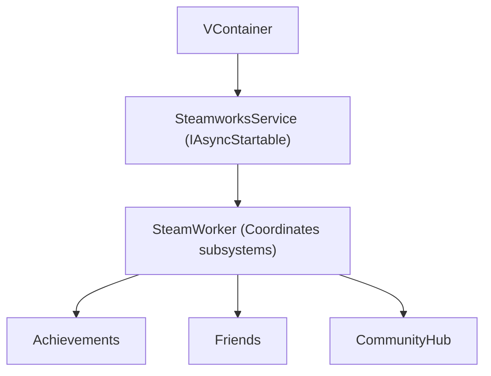

import {
	Card,
	CardGrid,
	LinkCard,
	Steps,
	Aside,
	Tabs,
	TabItem,
} from '@astrojs/starlight/components';

<Aside>

RareIcon is an action-packed RPG developed in Unity, blending intense bullet hell shooting mechanics with strategic base building.

The purpose of this guide is to provide an overview of the game, its core features, and tips for optimizing your gameplay experience to master its dynamic challenges.

Utilize this guide to enhance your skills, build formidable bases, and dominate the bullet hell battles in RareIcon.

</Aside>

## RareIcon

RareIcon is a thrilling action RPG crafted in [Unity](/application/unity/), immersing players in a vibrant world where strategic base building meets frenetic bullet hell combat.
As a player, you take on the role of a hero navigating treacherous environments, battling waves of enemies with fast-paced, projectile-dodging gameplay, and constructing bases to secure resources and defenses.
The game's unique blend of genres demands both tactical planning and quick reflexes, making it a standout title in the indie gaming scene.

By mastering enemy patterns, optimizing base layouts, and upgrading your character's abilities, you can conquer the challenges of RareIcon and carve out your legacy in its dynamic universe.

## Gameplay Mechanics

RareIcon's gameplay revolves around two core pillars: bullet hell shooting and base building.
The bullet hell mechanics require players to navigate intricate patterns of enemy projectiles, demanding precision and quick decision-making.
Meanwhile, base building allows players to construct and manage fortifications, resource hubs, and defensive systems to support their adventures.
Thus, balancing these elements is key to progressing through the game's increasingly difficult levels.
Effective gameplay involves upgrading weapons, optimizing base efficiency, and adapting to enemy strategies, ensuring a rewarding and engaging experience.

### Bullet Hell Combat

Bullet hell combat in RareIcon is characterized by intense, fast-paced battles where players must dodge dense barrages of enemy projectiles while retaliating with powerful attacks.
Success in these encounters relies on understanding enemy attack patterns, mastering movement, and strategically timing your abilities.
The game rewards skillful play with resources and upgrades that enhance your combat capabilities, making it essential to refine your reflexes and tactics.
If you are an old man like h0lybyte, then using the drones and additional helper characters can provide assistance and make up for your terrible reflexes, but it will result in less resources because of the upkeep costs.
---

## ItemDB

The [ItemDB](/itemdb/) is the full collection of every item or object within the RareIcon universe, making it easier to keep track and learn the different mechanics.
 

---

## Orchestrator

Within the MMExtensions, the Orchestrator will handle the movement, health and stats of the characters while also providing data sync between the client and server.
It is built with [VContainer](/application/unity/#vcontianer) and operates as a global dependency injection. 

---

## Space Steam DB

### Steam

