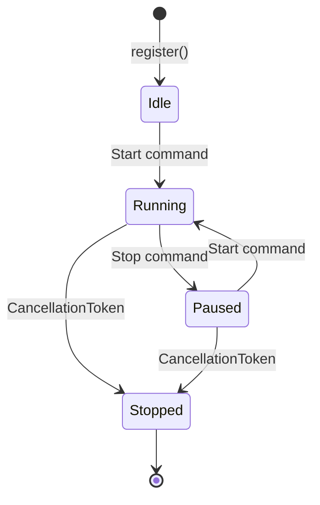
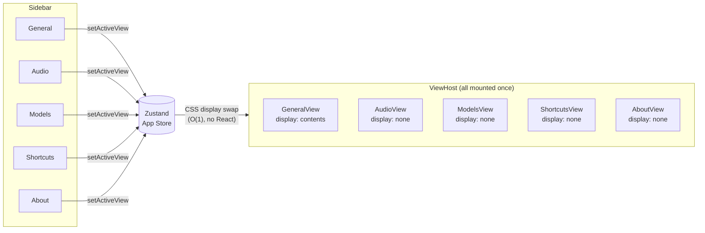
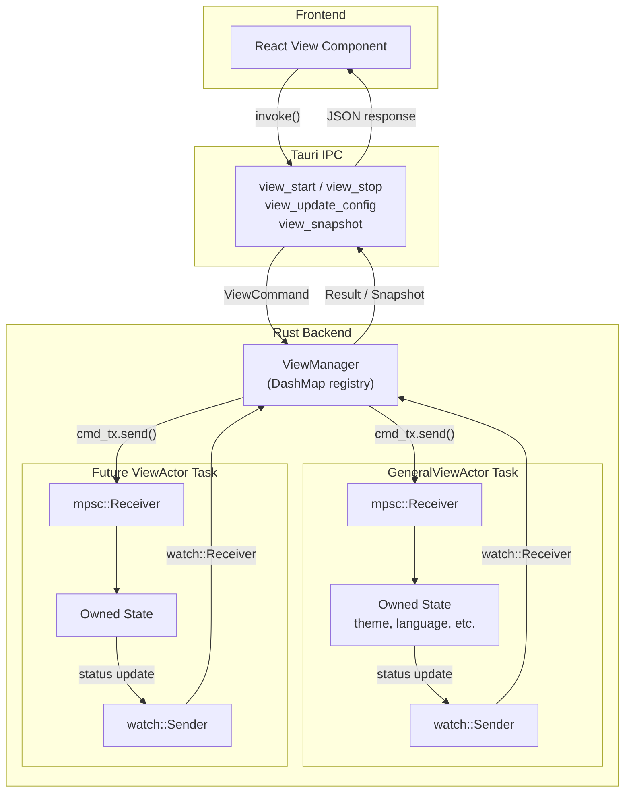

# desktop-kbve

Cross-platform desktop application. Tauri 2 + React 19 + Rust.

## Stack

| Layer       | Tech                                                        |
| ----------- | ----------------------------------------------------------- |
| Shell       | Tauri 2 (WebView)                                           |
| Frontend    | React 19, Vite 7, Tailwind 4, Zustand 5                     |
| Backend     | Rust, Tokio (async runtime)                                 |
| Concurrency | Actor model — DashMap registry, mpsc channels, watch status |

## Architecture

### View Lifecycle



### Frontend View Routing



### Backend Actor Message Flow



### Frontend: O(1) View Renderer

React is used as a **one-time templating engine**. After initial mount:

- **ViewHost** mounts all views once. Navigation swaps CSS `display` — no React reconciliation.
- **Slot** components subscribe to Zustand stores and patch DOM nodes directly, bypassing the virtual DOM.
- **View registry** defines available views declaratively. Adding a view = registering a component.

```
src/
  engine/       # Slot, ViewHost, registry — the rendering core
  stores/       # Zustand stores (app state, settings)
  views/        # Individual view modules (micro-apps)
  components/   # Shared UI primitives (SettingsCard, ToggleSwitch, etc.)
```

### Backend: Actor-Based View System

Each view runs as an isolated **tokio task** that owns its state. No `Arc<Mutex<T>>`.

- **ViewActor trait** — implement `run()` to define your view's async loop
- **mpsc channels** — frontend sends typed `ViewCommand` messages (Start, Stop, UpdateConfig, PushData, GetSnapshot, Custom)
- **watch channels** — views publish `ViewStatus` changes (Idle, Running, Paused, Stopped)
- **DashMap** — lock-free view registry, concurrent reads without contention
- **CancellationToken** — per-view graceful shutdown

```
src-tauri/src/
  views/
    mod.rs        # Module root, register_all()
    view.rs       # ViewActor trait
    command.rs    # ViewCommand enum, ViewStatus, ViewSnapshot
    handle.rs     # ViewHandle (channels + cancel token)
    manager.rs    # ViewManager (DashMap registry)
    general.rs    # Concrete: GeneralViewActor
  lib.rs          # Tauri setup, managed state, command handlers
```

### Tauri Commands

| Command              | Description                        |
| -------------------- | ---------------------------------- |
| `view_start`         | Send Start to a view actor         |
| `view_stop`          | Send Stop to a view actor          |
| `view_status`        | Get current ViewStatus             |
| `view_snapshot`      | Get full state snapshot from actor |
| `view_update_config` | Push config update into actor      |
| `view_list`          | List all views + statuses          |

## Development

```bash
# From monorepo root
npx nx run desktop-kbve:dev      # Vite dev server (port 1421)
npx nx run desktop-kbve:build    # Frontend build
npx nx run desktop-kbve:build:tauri  # Full desktop build
```

### Adding a New View

1. **Backend** — Create `src-tauri/src/views/myview.rs`, implement `ViewActor` trait, register in `mod.rs`
2. **Frontend** — Create `src/views/myview.tsx`, register in `src/views/index.ts` via `registerView()`

The view's actor task owns all mutable state. The frontend component mounts once and never unmounts.
