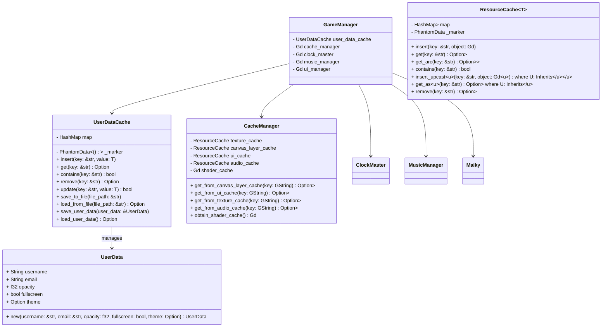

## Barckeys Game Jam 

### 2025.1

This will be KBVE entry to the Barckeys Game Jam!

For this entry, we will be using [Godot](/application/godot/) with [Rust](/application/rust/)

#### Team

Official Team Sign In Sheet! Make a fork and then a pull request with your name and itch.

- [h0lybyte](https://kbve.itch.io/)
- [SummationX](https://summationx.itch.io/)

