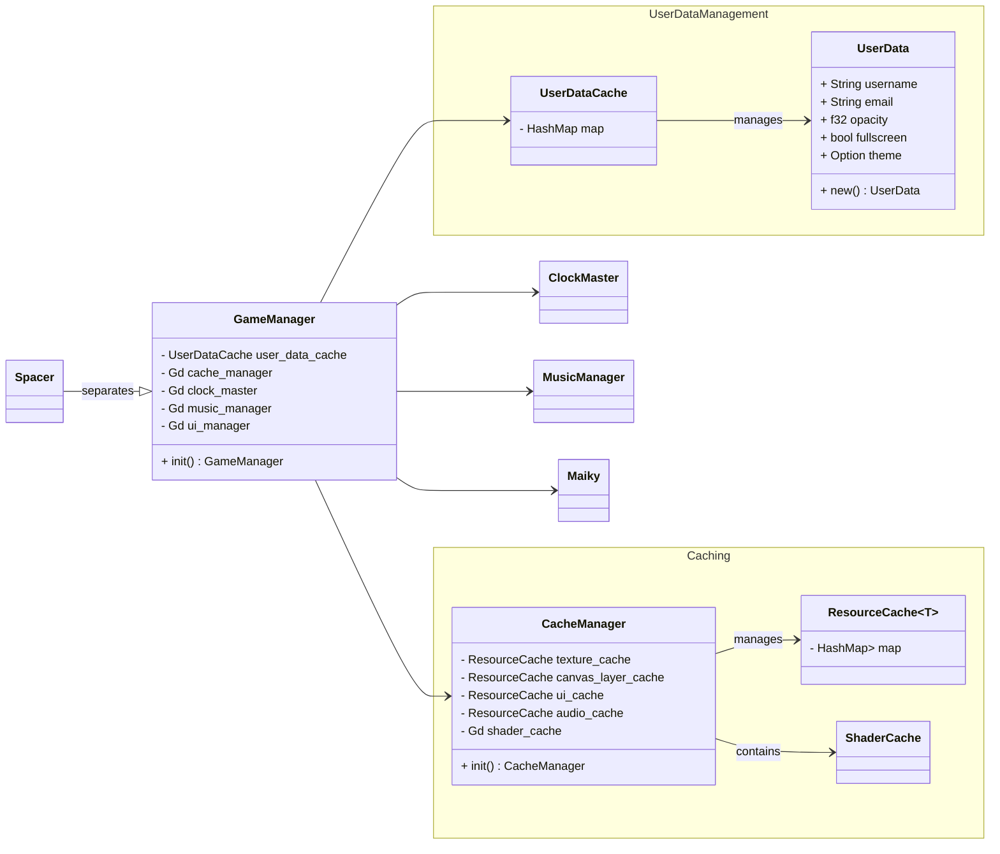

## Barckeys Game Jam 

### 2025.1

This will be KBVE entry to the Barckeys Game Jam!!
For this entry, we will be using [Godot](/application/godot/) with [Rust](/application/rust/)

The theme for this jam is `ERASE` and the wild cards are:

* Mimic - Something is not what it seems.
* Style Shift - Visuals switch between two art styles.
* Shopaholic - include some kind of shopping mechanism.

#### Team

Official Team Sign In Sheet! Make a fork and then a pull request with your name and itch.

- [h0lybyte](https://kbve.itch.io/)
- [SummationX](https://summationx.itch.io/)

### FlowChart

Starting the basics of the flow chart, while writing out the rust code.

