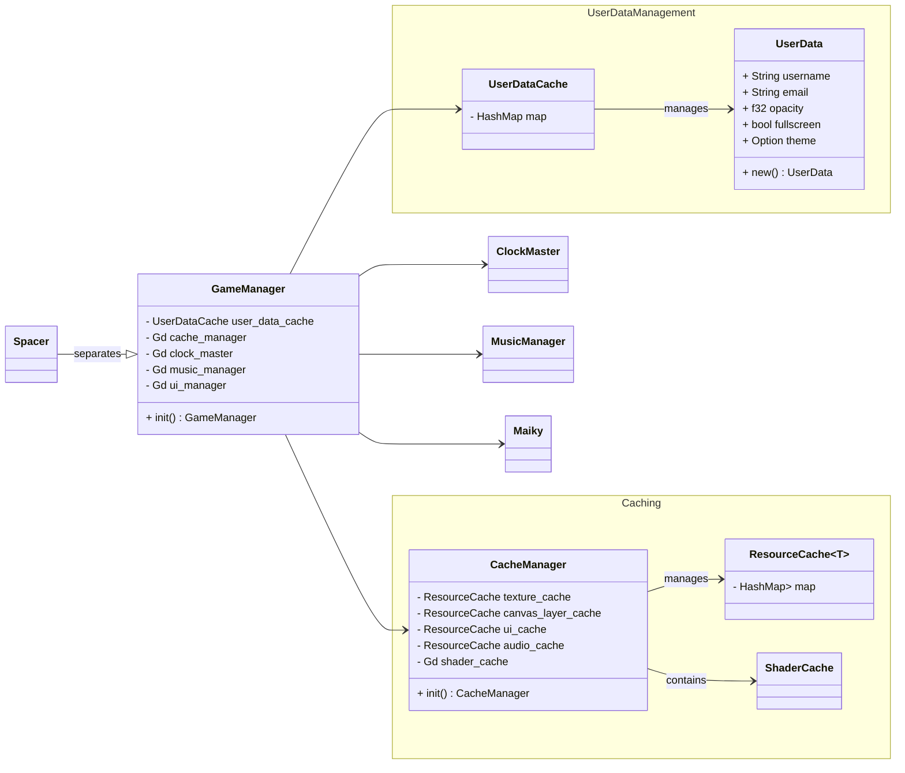

import {
	Aside,
	Steps,
	Card,
	CardGrid,
	Code,
	FileTree,
} from '@astrojs/starlight/components';

## Barckeys Game Jam 


### 2025.1

This will be KBVE entry to the Barckeys Game Jam!!
For this entry, we will be using [Godot](/application/godot/) with [Rust](/application/rust/)

The main theme for the jam is `Nothing Can Go Wrong`.

The theme for the sister jam, hosted by Wild, is `ERASE` and the wild cards are:

* Mimic - Something is not what it seems.
* Style Shift - Visuals switch between two art styles.
* Shopaholic - include some kind of shopping mechanism.

#### Submission

-   `How does the game fit the theme?`

    Nothing can go wrong when you are piloting the ship! We made a game that is similar to Asteroids but the ship does not automatically get destoried.
    Our goal was to make an idle space game that you can play anytime you want, without having to pay attention or worry about destruction.
    However we did add some challenges and bonuses to the game!
    
-   `What code and assets did you not make from scratch during the jam, if any?`

    Code, we used godot and a couple extension examples, like GDExt.
    As for the assets, we used several from Kenny.nl, OpenGameArt and itch assets, all of which are listed in our game description.
    This includes but not limited to, Auidioknobs from OpenGameArt, Kenny.nl's Space Redux, VOID pack by Foozlecc from Itch, Galaxy Pixel Art by Iftikhar Alam from Vecteezy / IftiStock.com and Pixel Space BG by Norma 2D from Itch.
    


#### Team

Official Team Sign In Sheet! Make a fork and then a pull request with your name and itch.

- [h0lybyte](https://kbve.itch.io/)
- [SummationX](https://summationx.itch.io/)
- Ron?
- Spaceman ?

### FlowChart

Starting the basics of the flow chart, while writing out the rust code.



### GameDocs

Game description
You wake up in a miner spaceship, and everybody is gone. And worse of it all, sparks appear in different 
parts of the ship, concluding that the space ship already undergoes different hardship and you hope that nothing goes wrong.

### UIUX
An analog spaceship UI could have scratched metal textures, 
dimly glowing buttons, slightly flickering holographic elements, and a worn-down control panel vibe.
crt display?
inspired by spaceteam

### Gameplay Loop
- Mine asteroids and harvest scraps across the space to earn money. 
- Fix and upgrade you ship.
- You will encounter various anomly that can be good or bad for you.

### Assets

#### Space Shooter Redux
The spaceship asset pack that we will be using is from [Kenny Space Shooter Redux](https://kenney.nl/assets/space-shooter-redux), released as a CC0.
There are two folders, `_space-shooter-redux` and `space-shooter-redux`, all of the assets from the pack are under the `_space-shooter-redux` and objects that we will use will be copied over to `space-shooter-redux`.
Without having to dump a bunch of assets, I will try to use as many as needed and then going to delete the `_space-shooter-redux` folder.

#### auidioknobs
This asset will be used as UI panel that players will interact with in the world. [auidioknobs](https://opengameart.org/node/7969), released as CC-BY-3.0.
Credited to ville.seppanen@gmail.com

#### Galaxy Pixel Art

The first three objects for the universe layer were made by Iftikhar Alam from Vecteezy / IftiStock.com.

#### Pixel Space Background

The main background of the `timespace` layer comes from the [Space Backgorund Pixel Art Pack](https://norma-2d.itch.io/space-backgrounds-pack).

#### Void Fleet Pack

The spaceship will come from the [Void Fleet Pack 3](https://foozlecc.itch.io/void-fleet-pack-3) , which is released as a CC0 license.
Then there is the [Void Fleet Pack 1](https://foozlecc.itch.io/void-fleet-pack-1), that we will be using for the main ship.

#### Pixel Art Sci Fi Spaceships

This is the spaceship asset pack from FrostWindz, [Pixel Art Sci Fi Spacepack](https://frostwindz.itch.io/pixel-art-sci-fi-spaceships).

### Layers

These are the layers that I am thinking we will be operating in:

```

2d_physics/layer_1="timespace"
2d_physics/layer_2="universe"
2d_physics/layer_3="galaxy"
2d_physics/layer_4="environment"
2d_physics/layer_5="planet"
2d_physics/layer_6="spaceship"
2d_physics/layer_7="npc"
2d_physics/layer_8="entity"
2d_physics/layer_9="projectile"

```

The first three layers, `timespace`, `universe` and `galaxy` will act as the background layers and the `environment` will be the first delta-time layer from the client-side point of view.
Using the layer 1 through 3, we can create a parallax style simulation of space.
The actual ship that the player controls will inherit the layer 6 aka `spaceship`.
Finally we would split the `npc` and `entity` layer because we might want the `npc` to have additional abilities, like a star path finding.


<Steps>

1.  Timespace
    - Tracks the time without a reference to frames.

2.  Universe
    - Client-side background

3.  Galaxy
    - Sub-background with the purpose of creating a parallax effect.

4.  Environment
    - Tracks the delta-time, with a reference to the client's frame.

5.  Planet
    - This layer will include spacestations and presents an entity that has true collision.
    - Players will be to enter the planet, which can open up minigames or special UI screens.

    The first planet that we will be adding is an Earth-like one, located at X: 0, Y: 0!
    This planet will serve as the base shop for upgrading your ship.

6.  Spaceship
    - The actual layermask for the player.

7.  NPC
    - Layermask for pirates or friendly ships.

8.  Entity
    - Layermask for objects that can be mined, cause damage and/or hold any interaction.

9.  Projectile
    - Ammo shells and lasers, used to raycast hits as well.

</Steps>

### Global Resources

The idea behind this singleton is to hold the spaceship stats and resources, including the gold, metal, stone, ect...
I went ahead and designed it to be modular, so we can add any resource we want without having to go crazy trying to refactor it in.

Current List of Resources:

```json
{
	"gold": 0,
	"stone": 0,
	"metal": 0,
	"gems": 0
}
```

<Steps>

1.  Gold
    - This is the main currency of the game.

2.  Stone
    - A resource for building objects within the ship.

3.  Metal
    - A limited resource for building upgrades for the ship.

4.  Gems
    - A rare resource for special upgrades.

</Steps>

#### Entity

```
Asteroid
Meteor
Comet

```

<Steps>

1.  Asteroid
    -   Large entity that spawns meteors upon destruction.
    -   Drops stone resources.
    -   Poolable Entity, can be expanded from the spaceport upgrade.

2.  Meteor
    -   Medium entity that gets created after an asteroid is hit by laser.
    -   Drops metal resources.
    -   Moves slowly but despawns after leaving the scene.
    -   Poolable Entity, increase from 1-3 drop to 5+ as an upgrade from the spaceport.

3.  Comet
    -   Small entity that has a chance to spawn after a meteor is hit by a laser.
    -   Rare drops like gold and gems but always drops metal.
    -   Moves quickly and despawns after leaving the scene.
    -   Poolable Entity, but limited to only max of 5 that drop on the screen, % of drop increases via upgrades from the spaceport.


</Steps>

#### Resource Examples

```

Global.earn_resource("gold", 100, "Mission Reward: Killing Fudster") 
Global.earn_resource("stone", 50, "Mining Bonus")  

```

For using the resources, it would be like this:

```

if Global.spend_resource("gold", 50, "Bought Shield Upgrade"):
    print("Purchase successful!")
else:
    print("Not enough gold!")

```

Then on the UI, we can listen to the signals and make changes.

```

func _ready():
    Global.connect("resource_changed", _on_resource_updated)
    Global.connect("resource_receipt", _on_resource_receipt)

func _on_resource_updated(resource_name, new_value):
    print(resource_name + " updated: " + str(new_value))

func _on_resource_receipt(resource_name, amount, new_value, invoice):
    print("Transaction: ", invoice, " Resource: ", resource_name, " Amount: ", amount, " New Balance: ", new_value)

```

#### Drop Rate

The default drop rate of resources like stone will be 3 to 15, then we can use the space port to transfer the stone into metal.
Furthermore, we could add special asteroids that spawn into the game with bonus resources like gold, gems and metals. 

When an asteroid is hit initially, it should break into smaller ones that will include the chance to spawn a rare comet.


### Weapons

The first weapon that we will introduce is the laser for the spaceship, later on we will include a couple more guns, maybe a machine gun type weapon.
Majority of the laser's logic will be stored under `/scripts/laser.gd` and we will not implement any sort of pooling for it yet, that might be something that I will look into later on.


### Heat

Heat management is vital when piloting the ship because once the player goes over the heat, the ship should stop moving.
The movement of the engines and the lasers would stop, thus it acts like an anti-spam.
As for the heat release, we will have a couple keys to help the exhausting of the said heat, but we can go further into that before finishing up the game.

### Earth

The Earth planet will be on layer 5 with collision mask being for layer 6 aka the spaceship.
Once the player is within the collision circle of the planet, a display will come up that says "Press X to Interact with the Planet!".
After the player presses the X, it should open up the shop UI and let the player purchase upgrades.