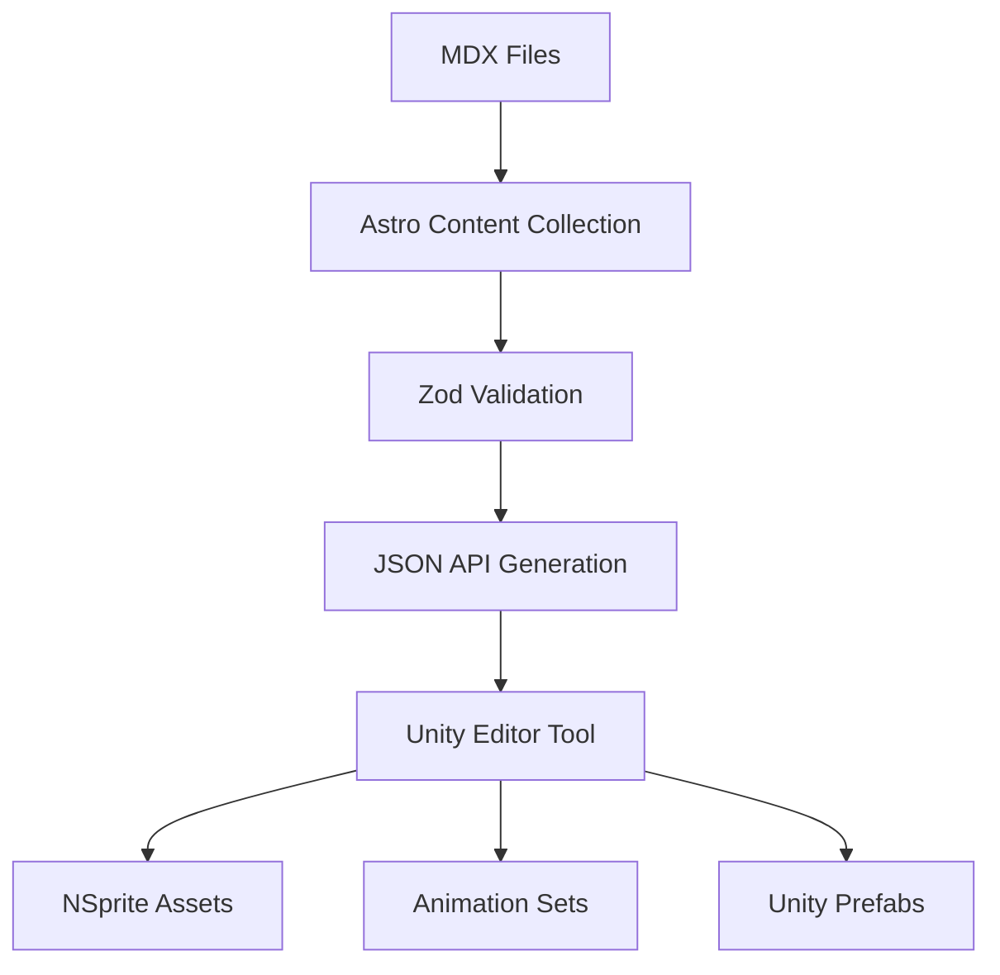

# NPCDB - NPC Database Editor Tool Documentation

## Overview
This document describes the complete NPC database pipeline from content creation to Unity asset generation. The system consists of two main parts:

1. **Unity Editor Tool (EditorNPC.cs)** - Fetches NPC data from a remote JSON API and automatically generates all required NSprite assets, animations, and prefabs for ECS-based NPCs.

2. **Content Management Pipeline (Astro/TypeScript)** - Manages NPC data as MDX files with Zod validation and generates the JSON API consumed by Unity.

> **Note**: The Astro/TypeScript content management system is **NOT part of the Unity project**. It's a separate web application that generates the JSON data consumed by the Unity Editor tool.

## Complete Pipeline Architecture



### Data Flow
1. **Content Creation**: NPCs are authored as MDX files with frontmatter
2. **Validation**: Astro processes MDX files through Zod schemas
3. **API Generation**: Astro builds JSON API endpoint from validated data
4. **Unity Consumption**: EditorNPC.cs fetches JSON and generates Unity assets
5. **Asset Creation**: Complete NSprite prefabs with animations ready for use

---

# PART 1: CONTENT MANAGEMENT PIPELINE (Astro/TypeScript)

> **Important**: This section describes the content management system that is **NOT part of the Unity project**. This is a separate Astro application that manages NPC data and generates the JSON API.

## Astro Project Structure
```
astro-kbve/
├── src/
│   ├── content/
│   │   └── npcs/
│   │       ├── wolf.mdx
│   │       ├── orc.mdx
│   │       └── skeleton.mdx
│   ├── data/
│   │   └── types/
│   │       ├── NPCTypes.ts
│   │       └── index.ts
│   └── pages/
│       └── api/
│           └── npcdb.json.ts
```

## Zod Schema Definition (NPCTypes.ts)

Following KBVE's established patterns for type validation:

```typescript
import { z } from 'zod';

// NPC Categories (following KBVE enum pattern)
const NPCCategories = ['beast', 'humanoid', 'undead', 'elemental', 'construct', 'dragon'] as const;
export type NPCCategory = typeof NPCCategories[number];
export const NPCCategoryEnum = z.enum(NPCCategories);

// Animation Types (standardized 4-animation system)
const AnimationTypes = ['walk', 'idle', 'attack', 'death'] as const;
export type AnimationType = typeof AnimationTypes[number];
export const AnimationTypeEnum = z.enum(AnimationTypes);

// ULID validation (following KBVE UtilityTypes pattern)
export const NPCIdSchema = z.string()
  .regex(/^[0-9A-HJKMNP-TV-Z]{26}$/, { message: 'Invalid NPC ULID' })
  .describe('Unique NPC identifier following ULID format');

// Frame Count Schema
export const FrameCountSchema = z.object({
  x: z.number().int().min(1).max(32).describe('Horizontal frame count (columns)'),
  y: z.number().int().min(1).max(16).describe('Vertical frame count (rows)')
}).describe('Animation frame grid dimensions');

// Frame Durations Schema
export const FrameDurationsSchema = z.object({
  walk: z.array(z.number().positive()).describe('Frame durations for walk animation'),
  idle: z.array(z.number().positive()).describe('Frame durations for idle animation'),
  attack: z.array(z.number().positive()).describe('Frame durations for attack animation'),
  death: z.array(z.number().positive()).describe('Frame durations for death animation')
}).describe('Animation frame timing configuration');

// Animation URLs Schema
export const AnimationUrlsSchema = z.object({
  walk_img: z.string().url().describe('URL path to walk animation sprite sheet'),
  idle_img: z.string().url().describe('URL path to idle animation sprite sheet'),
  attack_img: z.string().url().describe('URL path to attack animation sprite sheet'),
  death_img: z.string().url().describe('URL path to death animation sprite sheet')
}).describe('Animation sprite sheet URLs');

// Sprite Configuration Schema
export const SpriteConfigSchema = z.object({
  pixelsPerUnit: z.number().int().min(1).max(1024).default(16)
    .describe('Unity pixels per unit setting for sprite import'),
  frameCount: FrameCountSchema,
  frameDurations: FrameDurationsSchema
}).describe('Sprite animation configuration');

// NPC Physical Properties Schema
export const NPCPropertiesSchema = z.object({
  heightScale: z.number().positive().min(0.1).max(5.0).default(1.0)
    .describe('Scale multiplier for sprite height'),
  collisionRadius: z.number().positive().min(0.1).max(10.0).default(0.5)
    .describe('Physics collision radius in Unity units'),
  health: z.number().positive().min(1).max(10000).default(100)
    .describe('NPC health points'),
  moveSpeed: z.number().positive().min(0.1).max(20.0).default(2.0)
    .describe('Movement speed in Unity units per second'),
  damage: z.number().positive().min(1).max(1000).default(10)
    .describe('Attack damage value')
}).describe('NPC physical and gameplay properties');

// Rendering Configuration Schema
export const RenderingConfigSchema = z.object({
  sortingLayer: z.string().default('NPCs')
    .describe('Unity sorting layer name for sprite rendering'),
  sortingOrder: z.number().int().min(-32768).max(32767).default(0)
    .describe('Unity sorting order within layer'),
  material: z.string().default('default')
    .describe('Unity material reference for sprite rendering')
}).describe('Unity rendering configuration');

// Main NPC Schema
export const NPCSchema = z.object({
  id: NPCIdSchema,
  name: z.string().min(1).max(100).describe('Display name of the NPC'),
  type: NPCCategoryEnum.describe('NPC category classification'),
  description: z.string().max(500).describe('NPC description text'),
  category: z.number().int().min(0).describe('Numeric category flag for gameplay systems'),

  animations: AnimationUrlsSchema,
  spriteConfig: SpriteConfigSchema,
  properties: NPCPropertiesSchema,
  rendering: RenderingConfigSchema
}).describe('Complete NPC definition');

// NPC Collection Schema
export const NPCCollectionSchema = z.object({
  npcs: z.array(NPCSchema).describe('Array of NPC definitions')
}).describe('Complete NPC database collection');

// TypeScript types
export type NPC = z.infer<typeof NPCSchema>;
export type NPCCollection = z.infer<typeof NPCCollectionSchema>;
export type FrameCount = z.infer<typeof FrameCountSchema>;
export type FrameDurations = z.infer<typeof FrameDurationsSchema>;
export type AnimationUrls = z.infer<typeof AnimationUrlsSchema>;
export type SpriteConfig = z.infer<typeof SpriteConfigSchema>;
export type NPCProperties = z.infer<typeof NPCPropertiesSchema>;
export type RenderingConfig = z.infer<typeof RenderingConfigSchema>;
```

## Astro Content Collection Configuration

```typescript
// astro.config.mjs
import { defineConfig } from 'astro/config';
import { defineCollection, z } from 'astro:content';
import { NPCSchema } from './src/data/types/NPCTypes';

const npcCollection = defineCollection({
  type: 'content',
  schema: NPCSchema
});

export const collections = {
  npcs: npcCollection
};
```

## MDX File Structure

Example NPC definition stored as `src/content/npcs/wolf.mdx`:

```mdx
---
id: "01HG8K2M3N4P5Q6R7S8T9V0W1X"
name: "Forest Wolf"
type: "beast"
description: "A fierce wolf that roams the dark forests, hunting in packs and showing remarkable intelligence."
category: 1

animations:
  walk_img: "/assets/npcs/wolf/wolf_walk.png"
  idle_img: "/assets/npcs/wolf/wolf_idle.png"
  attack_img: "/assets/npcs/wolf/wolf_attack.png"
  death_img: "/assets/npcs/wolf/wolf_death.png"

spriteConfig:
  pixelsPerUnit: 16
  frameCount:
    x: 8
    y: 1
  frameDurations:
    walk: [0.1, 0.15, 0.15, 0.1, 0.1, 0.15, 0.15, 0.1]
    idle: [0.3, 0.3, 0.3, 0.3]
    attack: [0.1, 0.1, 0.2, 0.15]
    death: [0.2, 0.2, 0.3, 1.0]

properties:
  heightScale: 0.25
  collisionRadius: 0.5
  health: 80
  moveSpeed: 2.5
  damage: 12

rendering:
  sortingLayer: "NPCs"
  sortingOrder: 0
  material: "default"
---

# Forest Wolf

The Forest Wolf is a common enemy found in woodland areas. Known for their pack hunting behavior and aggressive nature when threatened.

## Behavior Patterns
- **Pack Hunter**: Often spawns in groups of 2-4
- **Territorial**: Will chase players who enter their domain
- **Quick Attacks**: Fast attack animations with moderate damage

## Lore
These wolves have adapted to the magical corruption spreading through the forest, making them more aggressive and resilient than their natural counterparts.
```

## Astro API Endpoint Generation

```typescript
// src/pages/api/npcdb.json.ts
import type { APIRoute } from 'astro';
import { getCollection } from 'astro:content';
import { NPCCollectionSchema } from '../../data/types/NPCTypes';

export const GET: APIRoute = async () => {
  try {
    // Get all NPC entries from content collection
    const npcEntries = await getCollection('npcs');

    // Transform to JSON format expected by Unity
    const npcs = npcEntries.map(entry => ({
      ...entry.data,
      // Convert any additional processing needed
      slug: entry.slug,
      lastModified: entry.data.astro?.lastModified || new Date().toISOString()
    }));

    // Validate the complete collection
    const validatedData = NPCCollectionSchema.parse({ npcs });

    return new Response(JSON.stringify(validatedData, null, 2), {
      status: 200,
      headers: {
        'Content-Type': 'application/json',
        'Cache-Control': 'public, max-age=3600', // Cache for 1 hour
        'Access-Control-Allow-Origin': '*' // Allow Unity to fetch
      }
    });
  } catch (error) {
    console.error('Error generating NPC database:', error);

    return new Response(JSON.stringify({
      error: 'Failed to generate NPC database',
      details: error instanceof Error ? error.message : 'Unknown error'
    }), {
      status: 500,
      headers: {
        'Content-Type': 'application/json'
      }
    });
  }
};
```

## Content Validation and Build Process

```typescript
// scripts/validate-npcs.ts
import { getCollection } from 'astro:content';
import { NPCSchema } from '../src/data/types/NPCTypes';

export async function validateNPCs() {
  const npcs = await getCollection('npcs');
  const errors: string[] = [];

  for (const npc of npcs) {
    try {
      NPCSchema.parse(npc.data);
      console.log(`✅ ${npc.slug}: Valid`);
    } catch (error) {
      const errorMsg = `❌ ${npc.slug}: ${error.message}`;
      errors.push(errorMsg);
      console.error(errorMsg);
    }
  }

  if (errors.length > 0) {
    throw new Error(`NPC validation failed:\n${errors.join('\n')}`);
  }

  console.log(`✅ All ${npcs.length} NPCs validated successfully`);
}
```

---

# PART 2: UNITY EDITOR TOOL IMPLEMENTATION

## Architecture

### Unity File Structure
```
Assets/Dungeon/ECS/Nsprite/
├── [NPCType]/
│   ├── [type]_walk.png
│   ├── [type]_idle.png
│   ├── [type]_attack.png
│   ├── [type]_death.png
│   ├── Walk.asset (SpriteAnimation)
│   ├── Idle.asset (SpriteAnimation)
│   ├── Attack.asset (SpriteAnimation)
│   ├── Death.asset (SpriteAnimation)
│   ├── AnimationSet.asset (SpriteAnimationSet)
│   └── [NPCType].prefab
```

## JSON Data Structure

```json
{
  "npcs": [
    {
      "id": "wolf",
      "name": "Wolf",
      "type": "beast",
      "description": "A fierce wolf",
      "category": 1,

      // Animation URLs
      "animations": {
        "walk_img": "/assets/npcs/wolf/wolf_walk.png",
        "idle_img": "/assets/npcs/wolf/wolf_idle.png",
        "attack_img": "/assets/npcs/wolf/wolf_attack.png",
        "death_img": "/assets/npcs/wolf/wolf_death.png"
      },

      // Sprite Configuration
      "spriteConfig": {
        "pixelsPerUnit": 16,
        "frameCount": {
          "x": 8,
          "y": 1
        },
        "frameDurations": {
          "walk": [0.1, 0.2, 0.2, 0.2, 0.15, 0.2, 0.15, 0.1],
          "idle": [0.2, 0.2, 0.2, 0.2],
          "attack": [0.1, 0.1, 0.15, 0.2],
          "death": [0.2, 0.2, 0.3, 0.5]
        }
      },

      // Physical Properties
      "properties": {
        "heightScale": 0.25,
        "collisionRadius": 0.5,
        "health": 100,
        "moveSpeed": 2.0,
        "damage": 10
      },

      // Rendering
      "rendering": {
        "sortingLayer": "NPCs",
        "sortingOrder": 0,
        "material": "default"
      }
    }
  ]
}
```

## Implementation Code Structure

### Main Class Structure

```csharp
#if UNITY_EDITOR
using UnityEditor;
using UnityEngine;
using UnityEngine.Networking;
using Unity.EditorCoroutines.Editor;
using System.IO;
using System.Collections;
using System.Collections.Generic;
using Unity.Entities;
using Unity.Mathematics;
using NSprites;
using KBVE.MMExtensions.Database;
using KBVE.MMExtensions.Orchestrator.DOTS;
using Newtonsoft.Json;

namespace KBVE.MMExtensions.Database
{
    public class EditorNPCDB : EditorWindow
    {
        // API Configuration
        private const string ApiUrl = "https://kbve.com/api/npcdb.json";
        private const string BaseImageUrl = "https://kbve.com";

        // Asset Paths
        private const string NPCBaseFolder = "Assets/Dungeon/ECS/Nsprite/";
        private const string NPCDataFolder = "Assets/Dungeon/Data/NPCs/";
        private const string MaterialPath = "Assets/Dungeon/Materials/NPCDefault.mat";

        // Animation indices standard
        private enum AnimationType
        {
            Walk = 0,
            Idle = 1,
            Attack = 2,
            Death = 3
        }

        [MenuItem("KBVE/Database/Sync NPCDB")]
        public static void SyncNPCDatabase()
        {
            EditorCoroutineUtility.StartCoroutineOwnerless(FetchAndGenerateNPCs());
        }
```

### Core Methods

#### 1. Main Fetch and Generate Method
```csharp
        private static IEnumerator FetchAndGenerateNPCs()
        {
            using UnityWebRequest request = UnityWebRequest.Get(ApiUrl);
            yield return request.SendWebRequest();

            if (request.result != UnityWebRequest.Result.Success)
            {
                Debug.LogError($"Failed to fetch NPCDB: {request.error}");
                yield break;
            }

            var wrapper = JsonConvert.DeserializeObject<NPCListWrapper>(request.downloadHandler.text);

            foreach (var npc in wrapper.npcs)
            {
                // Create NPC folder structure
                string npcFolder = $"{NPCBaseFolder}{npc.id}/";
                Directory.CreateDirectory(npcFolder);

                // Download all animation sprites
                yield return DownloadNPCAnimations(npc, npcFolder);

                // Create animation assets
                var animations = CreateAnimationAssets(npc, npcFolder);

                // Create animation set
                var animationSet = CreateAnimationSet(animations, npcFolder, npc.id);

                // Create NPC prefab
                CreateNPCPrefab(npc, animationSet, npcFolder);
            }

            AssetDatabase.SaveAssets();
            AssetDatabase.Refresh();
            Debug.Log("NPCDB sync complete.");
        }
```

#### 2. Download Animation Sprites
```csharp
        private static IEnumerator DownloadNPCAnimations(NPCEntry npc, string npcFolder)
        {
            string[] animationTypes = { "walk", "idle", "attack", "death" };

            foreach (var animType in animationTypes)
            {
                string imageUrl = GetAnimationUrl(npc.animations, animType);
                string fileName = $"{npc.id}_{animType}.png";
                string localPath = Path.Combine(npcFolder, fileName);

                using (UnityWebRequest texRequest = UnityWebRequestTexture.GetTexture(imageUrl))
                {
                    yield return texRequest.SendWebRequest();

                    if (texRequest.result != UnityWebRequest.Result.Success)
                    {
                        Debug.LogWarning($"Failed to download {animType} animation for {npc.id}: {texRequest.error}");
                        continue;
                    }

                    var texture = DownloadHandlerTexture.GetContent(texRequest);
                    File.WriteAllBytes(localPath, texture.EncodeToPNG());
                    Debug.Log($"Saved {animType} animation: {localPath}");
                }

                AssetDatabase.ImportAsset(localPath, ImportAssetOptions.ForceUpdate);

                // Apply sprite import settings
                ApplySpriteImportSettings(localPath, npc.spriteConfig);
            }
        }
```

#### 3. Apply Sprite Import Settings
```csharp
        private static void ApplySpriteImportSettings(string spritePath, SpriteConfig config)
        {
            TextureImporter importer = (TextureImporter)TextureImporter.GetAtPath(spritePath);
            if (importer != null)
            {
                importer.textureType = TextureImporterType.Sprite;
                importer.spriteImportMode = SpriteImportMode.Single;
                importer.spritePixelsPerUnit = config.pixelsPerUnit;
                importer.mipmapEnabled = false;
                importer.alphaIsTransparency = true;
                importer.filterMode = FilterMode.Point;
                importer.textureCompression = TextureImporterCompression.Uncompressed;
                importer.spritePivot = new Vector2(0.5f, 0.5f);
                importer.SaveAndReimport();
            }
        }
```

#### 4. Create Animation Assets
```csharp
        private static Dictionary<AnimationType, SpriteAnimation> CreateAnimationAssets(NPCEntry npc, string npcFolder)
        {
            var animations = new Dictionary<AnimationType, SpriteAnimation>();
            string[] animTypes = { "Walk", "Idle", "Attack", "Death" };

            for (int i = 0; i < animTypes.Length; i++)
            {
                string animName = animTypes[i];
                AnimationType animType = (AnimationType)i;
                string spritePath = $"{npcFolder}{npc.id}_{animName.ToLower()}.png";
                string assetPath = $"{npcFolder}{animName}.asset";

                // Load or create SpriteAnimation asset
                SpriteAnimation animAsset = AssetDatabase.LoadAssetAtPath<SpriteAnimation>(assetPath);
                if (animAsset == null)
                {
                    animAsset = ScriptableObject.CreateInstance<SpriteAnimation>();
                    AssetDatabase.CreateAsset(animAsset, assetPath);
                }

                // Configure animation
                Sprite sprite = AssetDatabase.LoadAssetAtPath<Sprite>(spritePath);
                if (sprite != null)
                {
                    animAsset.SpriteSheet = sprite;
                    animAsset.FrameCount = npc.spriteConfig.frameCount;
                    animAsset.FrameRange = new SpriteAnimation.FrameRangeData
                    {
                        Offset = 0,
                        Count = npc.spriteConfig.frameCount.x * npc.spriteConfig.frameCount.y
                    };
                    animAsset.FrameDurations = GetFrameDurations(npc.spriteConfig.frameDurations, animName.ToLower());

                    EditorUtility.SetDirty(animAsset);
                    animations[animType] = animAsset;
                }
            }

            return animations;
        }
```

#### 5. Create Animation Set
```csharp
        private static SpriteAnimationSet CreateAnimationSet(
            Dictionary<AnimationType, SpriteAnimation> animations,
            string npcFolder,
            string npcId)
        {
            string assetPath = $"{npcFolder}AnimationSet.asset";

            SpriteAnimationSet animSet = AssetDatabase.LoadAssetAtPath<SpriteAnimationSet>(assetPath);
            if (animSet == null)
            {
                animSet = ScriptableObject.CreateInstance<SpriteAnimationSet>();
                AssetDatabase.CreateAsset(animSet, assetPath);
            }

            // Build animations array in correct order
            var namedAnimations = new List<SpriteAnimationSet.NamedAnimation>();

            foreach (AnimationType animType in Enum.GetValues(typeof(AnimationType)))
            {
                if (animations.TryGetValue(animType, out var animation))
                {
                    namedAnimations.Add(new SpriteAnimationSet.NamedAnimation
                    {
                        name = animType.ToString(),
                        data = animation
                    });
                }
            }

            // Use reflection to set private field (or modify NSprites to have setter)
            var animationsField = typeof(SpriteAnimationSet).GetField("_animations",
                System.Reflection.BindingFlags.NonPublic | System.Reflection.BindingFlags.Instance);
            animationsField?.SetValue(animSet, namedAnimations.ToArray());

            EditorUtility.SetDirty(animSet);
            return animSet;
        }
```

#### 6. Create NPC Prefab
```csharp
        private static GameObject CreateNPCPrefab(NPCEntry npc, SpriteAnimationSet animationSet, string npcFolder)
        {
            string prefabPath = $"{npcFolder}{npc.id}.prefab";

            // Create or load GameObject
            GameObject npcObject = new GameObject(npc.id);

            // Add SpriteAnimatedRendererAuthoring component
            var spriteRenderer = npcObject.AddComponent<SpriteAnimatedRendererAuthoring>();

            // Configure animation module
            spriteRenderer.AnimationAuthoringModule = new AnimationAuthoringModule
            {
                AnimationSet = animationSet,
                InitialAnimationIndex = (int)AnimationType.Idle
            };

            // Configure sprite rendering
            var material = AssetDatabase.LoadAssetAtPath<Material>(MaterialPath);
            spriteRenderer.RegisterSpriteData = new RegisterSpriteAuthoringModule
            {
                SpriteRenderData = new SpriteRenderData
                {
                    Material = material,
                    PropertiesSet = GetOrCreatePropertiesSet()
                }
            };

            // Configure render settings
            spriteRenderer.RenderSettings = new SpriteSettingsAuthoringModule
            {
                Pivot = new float2(0.5f, 0.5f),
                Size = new float2(1, 1) * npc.properties.heightScale,
                LockSize = false,
                DrawMode = 0,
                TilingAndOffset = new float4(1, 1, 0, 0),
                Flip = float2.zero
            };

            // Configure sorting
            spriteRenderer.Sorting = new SortingAuthoringModule
            {
                StaticSorting = false,
                SortingIndex = npc.rendering.sortingOrder,
                SortingLayer = GetSortingLayerValue(npc.rendering.sortingLayer)
            };

            // Add ZombieAuthoring (or create generic NPCAuthoring)
            var zombieAuth = npcObject.AddComponent<ZombieAuthoring>();
            zombieAuth.Health = npc.properties.health;
            zombieAuth.MoveSpeed = npc.properties.moveSpeed;
            zombieAuth.CollisionRadius = npc.properties.collisionRadius;

            // Save as prefab
            PrefabUtility.SaveAsPrefabAsset(npcObject, prefabPath);
            GameObject.DestroyImmediate(npcObject);

            // Make addressable
            AddressableUtility.MakeAddressable(prefabPath, npc.id, "NPCs");

            return AssetDatabase.LoadAssetAtPath<GameObject>(prefabPath);
        }
```

### JSON Data Classes

```csharp
        [System.Serializable]
        public class NPCListWrapper
        {
            public List<NPCEntry> npcs;
        }

        [System.Serializable]
        public class NPCEntry
        {
            public string id;
            public string name;
            public string type;
            public string description;
            public int category;
            public AnimationUrls animations;
            public SpriteConfig spriteConfig;
            public NPCProperties properties;
            public RenderingConfig rendering;
        }

        [System.Serializable]
        public class AnimationUrls
        {
            public string walk_img;
            public string idle_img;
            public string attack_img;
            public string death_img;
        }

        [System.Serializable]
        public class SpriteConfig
        {
            public int pixelsPerUnit = 16;
            public int2 frameCount = new int2(8, 1);
            public FrameDurationsConfig frameDurations;
        }

        [System.Serializable]
        public class FrameDurationsConfig
        {
            public float[] walk = { 0.1f };
            public float[] idle = { 0.2f };
            public float[] attack = { 0.15f };
            public float[] death = { 0.3f };
        }

        [System.Serializable]
        public class NPCProperties
        {
            public float heightScale = 1.0f;
            public float collisionRadius = 0.5f;
            public float health = 100f;
            public float moveSpeed = 2.0f;
            public float damage = 10f;
        }

        [System.Serializable]
        public class RenderingConfig
        {
            public string sortingLayer = "NPCs";
            public int sortingOrder = 0;
            public string material = "default";
        }
    }
}
#endif
```

## Helper Methods

### Get Animation URL
```csharp
private static string GetAnimationUrl(AnimationUrls animations, string animType)
{
    switch (animType.ToLower())
    {
        case "walk": return BaseImageUrl + animations.walk_img;
        case "idle": return BaseImageUrl + animations.idle_img;
        case "attack": return BaseImageUrl + animations.attack_img;
        case "death": return BaseImageUrl + animations.death_img;
        default: return null;
    }
}
```

### Get Frame Durations
```csharp
private static float[] GetFrameDurations(FrameDurationsConfig config, string animType)
{
    switch (animType.ToLower())
    {
        case "walk": return config.walk;
        case "idle": return config.idle;
        case "attack": return config.attack;
        case "death": return config.death;
        default: return new float[] { 0.1f };
    }
}
```

### Get Sorting Layer Value
```csharp
private static int GetSortingLayerValue(string layerName)
{
    var layer = SortingLayer.NameToID(layerName);
    return layer != 0 ? layer : SortingLayer.NameToID("Default");
}
```

## Usage

1. **Menu Access**: KBVE → Database → Sync NPCDB
2. **Process**:
   - Fetches JSON from API
   - Downloads all sprite animations
   - Creates animation assets
   - Builds animation sets
   - Generates prefabs with components
3. **Output**: Complete NPC prefabs ready for spawning in ECS

## Dependencies

- Unity.Entities
- NSprites Foundation
- Unity Editor Coroutines
- Newtonsoft.Json
- UnityEngine.Networking

## Notes

- All NPCs follow the standard 4-animation pattern (walk, idle, attack, death)
- Animation indices are fixed: 0=Walk, 1=Idle, 2=Attack, 3=Death
- Sprites are imported with Point filter mode for pixel art
- Prefabs include both rendering and gameplay components
- Addressables integration for runtime loading

## Future Enhancements

1. Support for custom animation counts
2. Animation state machine generation
3. Batch processing with progress bars
4. Custom authoring component per NPC type
5. LOD support for sprite rendering
6. Animation preview in editor
7. Validation and error recovery
8. Incremental updates (only changed NPCs)

## Example JSON Entry

```json
{
  "id": "orc",
  "name": "Orc Warrior",
  "type": "humanoid",
  "description": "A fierce orc warrior",
  "category": 2,
  "animations": {
    "walk_img": "/assets/npcs/orc/orc_walk.png",
    "idle_img": "/assets/npcs/orc/orc_idle.png",
    "attack_img": "/assets/npcs/orc/orc_attack.png",
    "death_img": "/assets/npcs/orc/orc_death.png"
  },
  "spriteConfig": {
    "pixelsPerUnit": 16,
    "frameCount": { "x": 8, "y": 1 },
    "frameDurations": {
      "walk": [0.1, 0.15, 0.15, 0.1, 0.1, 0.15, 0.15, 0.1],
      "idle": [0.3, 0.3, 0.3, 0.3],
      "attack": [0.1, 0.1, 0.2, 0.15],
      "death": [0.2, 0.2, 0.3, 1.0]
    }
  },
  "properties": {
    "heightScale": 0.3,
    "collisionRadius": 0.6,
    "health": 150,
    "moveSpeed": 1.8,
    "damage": 15
  },
  "rendering": {
    "sortingLayer": "NPCs",
    "sortingOrder": 0,
    "material": "default"
  }
}
```

## Troubleshooting

- **Missing Animations**: Check image URLs and network connectivity
- **Import Errors**: Verify sprite import settings and frame counts
- **Prefab Issues**: Ensure all required components are present
- **Animation Playback**: Verify frame durations array matches frame count

---

# TECHNICAL REFERENCE GUIDE

## Frame Count Configuration

The `frameCount` property defines how sprite frames are arranged in the texture:

### Structure
```json
"frameCount": { "x": 8, "y": 1 }
```

### Detailed Explanation
- **x**: Number of frames horizontally (columns)
- **y**: Number of frames vertically (rows)
- **Total Frames**: x * y = total frame count in animation

### Common Layouts
| Layout | frameCount | Description | Use Case |
|--------|------------|-------------|----------|
| `{ "x": 8, "y": 1 }` | 8 frames horizontal | Single row animation | Walk cycles, simple animations |
| `{ "x": 4, "y": 2 }` | 4x2 grid | Compact layout | Multiple short animations |
| `{ "x": 1, "y": 1 }` | Single frame | Static sprite | Idle poses, items |
| `{ "x": 6, "y": 1 }` | 6 frames horizontal | Medium animation | Attack sequences |
| `{ "x": 12, "y": 1 }` | 12 frames horizontal | Long animation | Complex actions, cutscenes |

### Frame Indexing
Frames are indexed from left-to-right, top-to-bottom:
```
For frameCount { "x": 4, "y": 2 }:
[0][1][2][3]
[4][5][6][7]
```

## Frame Durations Configuration

Frame durations control animation timing and feel:

### Structure
```json
"frameDurations": {
  "walk": [0.1, 0.15, 0.15, 0.1, 0.1, 0.15, 0.15, 0.1],
  "idle": [0.3, 0.3, 0.3, 0.3],
  "attack": [0.1, 0.1, 0.2, 0.15],
  "death": [0.2, 0.2, 0.3, 1.0]
}
```

### Duration Guidelines
| Duration Range | Effect | Best For |
|----------------|--------|----------|
| 0.05 - 0.1s | Very fast | Impact frames, quick actions |
| 0.1 - 0.2s | Fast | Normal walk cycles, combat |
| 0.2 - 0.4s | Medium | Idle breathing, slow movement |
| 0.4 - 1.0s | Slow | Dramatic poses, wind-up frames |
| 1.0s+ | Very slow | Death frames, special effects |

### Animation Timing Patterns
```json
// Walk Cycle (8 frames)
"walk": [0.1, 0.15, 0.15, 0.1, 0.1, 0.15, 0.15, 0.1]
// Pattern: quick-medium-medium-quick (for each step)

// Attack Sequence (4 frames)
"attack": [0.1, 0.1, 0.2, 0.15]
// Pattern: wind-up-wind-up-impact-recovery

// Death Animation (4 frames)
"death": [0.2, 0.2, 0.3, 1.0]
// Pattern: hit-stagger-fall-hold

// Idle Breathing (4 frames)
"idle": [0.3, 0.3, 0.3, 0.3]
// Pattern: consistent slow breathing
```

## Pixels Per Unit Guide

The `pixelsPerUnit` setting determines sprite scale in Unity:

### Common Values
| pixelsPerUnit | Scale | Best For |
|---------------|-------|----------|
| 16 | Large sprites | Retro games, platformers |
| 32 | Medium sprites | Top-down games, RPGs |
| 64 | Small sprites | Strategy games, detailed art |
| 100 | Unity default | General purpose |
| 128+ | Tiny sprites | Minimap icons, UI elements |

### Calculation
- **Unity Units**: 1 Unity unit = pixelsPerUnit pixels
- **Example**: With pixelsPerUnit=16, a 32px sprite = 2 Unity units

## Height Scale Reference

The `heightScale` property controls visual size:

### Scale Guidelines
| heightScale | Visual Size | Use Case |
|-------------|-------------|----------|
| 0.1 - 0.3 | Very small | Tiny creatures, insects |
| 0.3 - 0.6 | Small | Children, small animals |
| 0.6 - 1.0 | Medium | Human-sized NPCs |
| 1.0 - 1.5 | Large | Large humans, orcs |
| 1.5 - 3.0 | Very large | Giants, large monsters |
| 3.0+ | Massive | Dragons, bosses |

## Collision Radius Guide

Physics collision setup for different NPC types:

### Radius Guidelines
| collisionRadius | Physical Size | NPC Examples |
|-----------------|---------------|--------------|
| 0.1 - 0.3 | Tiny | Fairy, wisp, small critter |
| 0.3 - 0.5 | Small | Goblin, child, cat |
| 0.5 - 0.8 | Medium | Human, wolf, skeleton |
| 0.8 - 1.2 | Large | Orc, bear, armored knight |
| 1.2 - 2.0 | Very large | Ogre, tree ent, large beast |
| 2.0+ | Massive | Dragon, giant, siege unit |

### Collision Layer Setup
```csharp
// Unity Physics Layers (example)
// Layer 0: Default
// Layer 8: NPCs
// Layer 9: Player
// Layer 10: Environment

var filter = new Unity.Physics.CollisionFilter
{
    BelongsTo = 1u << 8,        // NPC layer
    CollidesWith = 0xFFFFFFFF,  // Collide with everything
    GroupIndex = 0              // No group filtering
};
```

## Movement Speed Reference

Speed values for different NPC archetypes:

### Speed Categories
| moveSpeed | Movement Type | NPC Examples |
|-----------|---------------|--------------|
| 0.5 - 1.0 | Very slow | Zombie, heavy armor, injured |
| 1.0 - 2.0 | Slow | Walking guard, elder, cautious |
| 2.0 - 3.0 | Normal | Human, most humanoids |
| 3.0 - 4.5 | Fast | Wolf, agile fighter, scout |
| 4.5 - 6.0 | Very fast | Horse, flying creature, assassin |
| 6.0+ | Extremely fast | Magic creature, boss dash |

## Sorting Layer Configuration

Unity rendering order management:

### Layer Hierarchy (back to front)
```
Background      (-100)
Environment     (0)
Ground Objects  (100)
NPCs           (200)
Player         (300)
Effects        (400)
UI             (500)
```

### Sorting Order Within Layers
- **NPCs**: 0-99 (based on type/importance)
- **Bosses**: 50-99 (render on top)
- **Regular enemies**: 0-49
- **Ambient creatures**: -10 to 0 (render behind)

## Material Configuration

Sprite rendering material setup:

### Standard Materials
| Material Type | Use Case | Properties |
|---------------|----------|------------|
| `Default-Sprite` | Normal NPCs | Standard rendering |
| `Sprite-Lit` | Dynamic lighting | Receives shadows |
| `Sprite-Unlit` | UI, effects | Always full bright |
| `Sprite-Additive` | Glowing effects | Additive blending |

### Custom Material Properties
```csharp
// Example material property overrides
material.SetFloat("_Alpha", 1.0f);           // Opacity
material.SetColor("_Color", Color.white);    // Tint color
material.SetFloat("_Metallic", 0.0f);        // Metallic look
material.SetFloat("_Smoothness", 0.0f);      // Surface smoothness
```

## Animation Index Reference

Standardized animation system:

### Fixed Animation Indices
```csharp
public enum AnimationType
{
    Walk = 0,    // Movement animation
    Idle = 1,    // Default/rest pose
    Attack = 2,  // Combat action
    Death = 3    // Defeat animation
}
```

### Animation State Machine
```
┌─────────┐    player nearby    ┌─────────┐
│  Idle   │ ──────────────────► │  Walk   │
│ (idx 1) │                     │ (idx 0) │
└─────────┘ ◄──────────────────┘─────────┘
     │           no movement              │
     │                                    │
     │ take damage                        │ combat range
     ▼                                    ▼
┌─────────┐                          ┌─────────┐
│  Death  │                          │ Attack  │
│ (idx 3) │                          │ (idx 2) │
└─────────┘                          └─────────┘
```

## File Naming Conventions

Consistent asset naming for organization:

### Sprite Files
```
{npc_id}_{animation_type}.png

Examples:
- wolf_walk.png
- orc_idle.png
- skeleton_attack.png
- dragon_death.png
```

### Asset Files
```
{Animation_Type}.asset

Examples:
- Walk.asset
- Idle.asset
- Attack.asset
- Death.asset
- AnimationSet.asset
```

### Prefab Files
```
{NPC_ID}.prefab

Examples:
- Wolf.prefab
- Orc.prefab
- FireElemental.prefab
```

## Error Handling Reference

Common issues and solutions:

### Animation Import Issues
```
Problem: Frame durations array length doesn't match frame count
Solution: Ensure array length = frameCount.x * frameCount.y

Problem: Sprite import fails
Solution: Check pixelsPerUnit > 0 and texture is readable

Problem: Missing animation frames
Solution: Verify frameRange.Count matches available frames
```

### Validation Errors
```typescript
// Zod validation error examples
"Invalid NPC ULID" → Check id format (26 char ULID)
"Pixels per unit must be positive" → Check pixelsPerUnit > 0
"Frame count x must be at least 1" → Check frameCount.x >= 1
"Animation URL must be valid" → Check URL format and accessibility
```

### Runtime Issues
```csharp
// Common prefab component issues
NullReferenceException → Check all component references assigned
Missing Material → Verify MaterialPath exists in project
Animation not playing → Check AnimationSet has valid animations
Physics issues → Verify CollisionRadius and layer settings
```

## Performance Considerations

Optimization guidelines for NPC assets:

### Texture Optimization
- **Max Resolution**: 512x512 for most NPCs
- **Compression**: Use appropriate compression for platform
- **Atlas Packing**: Group related animations in texture atlases
- **Mipmap**: Disable for 2D sprites to save memory

### Animation Optimization
- **Frame Count**: Limit to 8-16 frames for most animations
- **Duration**: Use longer durations to reduce frame rate
- **Reuse**: Share animation sets between similar NPCs
- **Culling**: Stop animations when NPCs are off-screen

### Memory Management
```csharp
// Addressable loading for large NPC collections
var handle = Addressables.LoadAssetAsync<GameObject>(npcId);
await handle.Task;
var npcPrefab = handle.Result;

// Remember to release when done
Addressables.Release(handle);
```